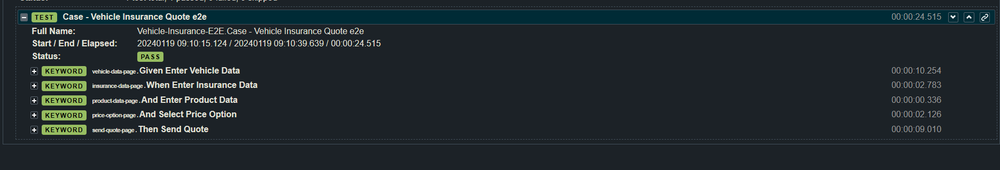

# Vehicle Insurance Quote Automation Project

## Overview

Este projeto em Robot Framework realiza testes automatizados end-to-end (e2e) em uma aplicação de Cotação de Seguro de Veículo. A estrutura do projeto segue o Modelo de Objeto de Página (POM) para melhor organização e legibilidade do código.

## Estrutura do Projeto

O projeto está organizado em diferentes diretórios, cada um servindo a um propósito específico:

- **archives:** Contém arquivos inputados para foto do usuario
  - `perfil.jpeg`

- **exec:** Contém executavel para o browser, deixado como referencia para utilização.
  - `chromedriver.exe`

- **features:** Contem as features do projeto, como os casos mapeados.
  - `vehicle-insurance-e2e.robot`

- **pages/actions:** Contém arquivos de recursos para diversas páginas, cada uma com palavras-chave relacionadas a ações específicas nessas páginas.
  - `insurance-data-page.robot`
  - `price-option-page.robot`
  - `product-data-page.robot`
  - `vehicle-data-page.robot`
  - `send-quote-page.robot`

  - **common:** Contém arquivos comuns entre os recursos.
  - `pages-common.robot`

  - **resouces** Contém arquivos de recursos como importações principais para os commandos.
  - `resource.robot`

<hr>

## Casos de Teste

### Caso - Vehicle Insurance Quote e2e

Este caso de teste cobre o processo completo de obtenção de uma cotação de seguro veicular. Ele usa palavras-chave dos arquivos de recursos mencionados acima para executar as seguintes etapas:

1. **Enter Vehicle Data**
   - Selecione marca e modelo
   - Insira detalhes como cilindrada, desempenho do motor, etc.
   - Navegue para a próxima etapa

2. **Enter Insurance Data**
   - Insira dados pessoais como nome, sobrenome, data de nascimento, etc.
   - Navegue para a próxima etapa

3. **Enter Product Data**
   - Forneça detalhes como data de início, valor do seguro, classificação, etc.
   - Navegue para a próxima etapa

4. **Select Price Option**
   - Escolha o pacote de seguros desejado (por exemplo, ouro, prata, etc.)
   - Navegue para a próxima etapa

5. **Send Quote**
   - Insira informações de contato do usuário e comentários adicionais
   - Envie o orçamento e verifique a mensagem de sucesso

## Utilização

### Pré-requisitos

Para executar o projeto, é necessário ter instalado:

- **Python:** [Download Python](https://www.python.org/downloads/)
- **Robot Framework:** Execute `pip install robotframework`
- **SeleniumLibrary:** Execute `pip install robotframework-seleniumlibrary`
- **Web Browser Driver:** Certifique-se de ter o driver apropriado do navegador web (por exemplo, ChromeDriver) disponível e configurado no sistema, foi deixado na pasta exec um executavel para utilização, mas necessario adequar no seu contexto.

### Executando o Teste

Para executar o caso de teste, utilize o seguinte comando no terminal:

```bash
robot features\vehicle-insurance-e2e.robot
```

